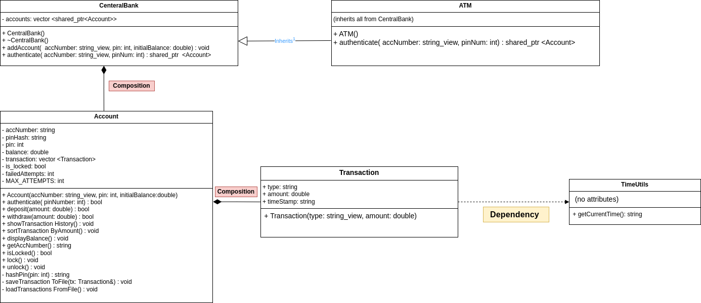
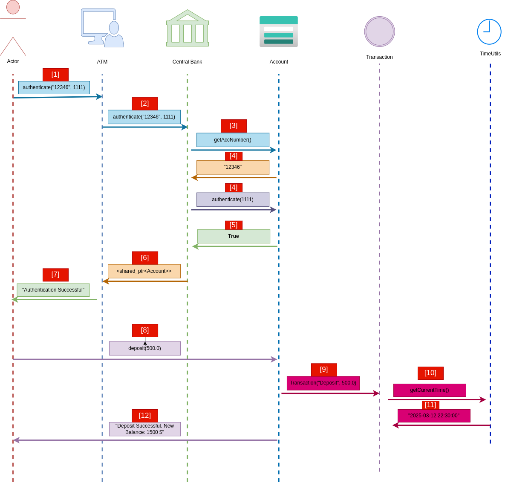

# ATM System "v0.1"


## Overview

This is a Modern C++ project implementing a simple ATM (Automated Teller Machine) system using object-oriented programming (OOP) principles. The system allows users to create accounts, authenticate using a PIN, deposit and withdraw funds, view transaction history, and sort transactions by amount. It includes security features like PIN hashing (using OpenSSL SHA256) and account lockout after three failed authentication attempts. Transaction data is persisted to files for each account.

The project demonstrates OOP concepts such as **inheritance**, **composition**, and **encapsulation**, with a class hierarchy involving a `CentralBank` base class and an `ATM` derived class.

---

## Features

- **Account Management**: Create accounts with an account number, PIN, and initial balance.
- **Authentication**: Secure PIN verification with SHA256 hashing and lockout after 3 failed attempts.
- **Transactions**: Deposit and withdraw funds, with transaction history stored in memory and files.
- **Sorting**: Sort transactions by amount in ascending order.
- **Storing**: Transactions are saved to text files in the `transactions/` directory.

1. **Sample Output**:
   ```
   Authentication Successful
   Current Balance: 1000 $
   Deposit Successful. New Balance: 1500 $
   Withdraw Successful. New Balance: 1300 $
   Transactions Sorted Ascending By Amount
   Transaction History for Account 12346:
   Withdraw of 200 $ on 2025-03-12 22:30:00
   Deposit of 500 $ on 2025-03-12 22:30:00
   ...
   Testing failed attempts:
   Authentication Failed. Attempt 1 of 3
   Authentication Failed. Attempt 2 of 3
   Authentication Failed. Attempt 3 of 3
   Account 12346 locked due to too many failed attempts.
   Authentication Failed
   ```

2. **Transaction Files**: Check the `transactions/` directory for files like `12346_transactions.txt` containing:
   ```
   Deposit,500,2025-03-12 22:30:00
   Withdraw,200,2025-03-12 22:30:00
   ```

---

## Static Design : 
- The static design represents the class structure and relationships using a UML Class Diagram.



---

## Sequence Diagrams :

- Sequence Diagrams illustrate the dynamic interactions between objects for key use cases.

### 1. Successful Authentication and Deposit
- Scenario: User authenticates account "12346" with PIN 1111 and deposits $500.




--- 

## Referances :

- https://docs.openssl.org/1.0.2/man3/sha/#description
- https://www.geeksforgeeks.org/class-stdstring_view-in-cpp-17/
- https://www.w3schools.com/cpp/ref_fstream_ofstream.asp
- https://www.tutorialspoint.com/cplusplus/cpp_files_streams.htm
- https://www.geeksforgeeks.org/stdstod-stdstof-stdstold-c/
- https://www.geeksforgeeks.org/unified-modeling-language-uml-class-diagrams/
- https://www.geeksforgeeks.org/unified-modeling-language-uml-sequence-diagrams/
